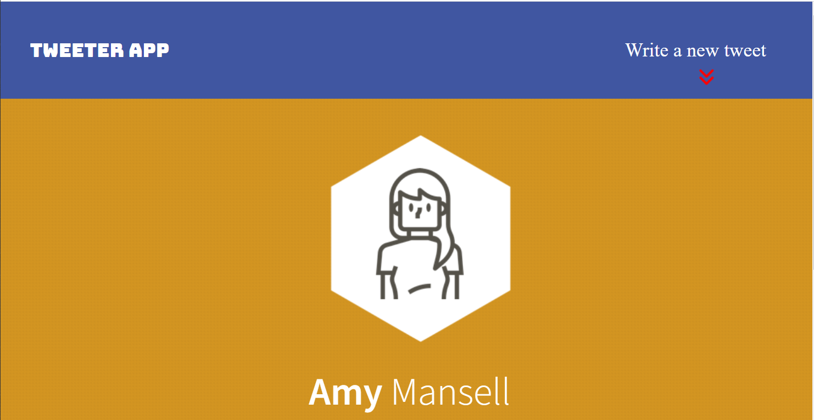
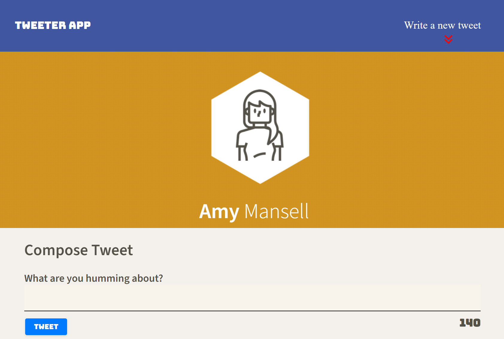
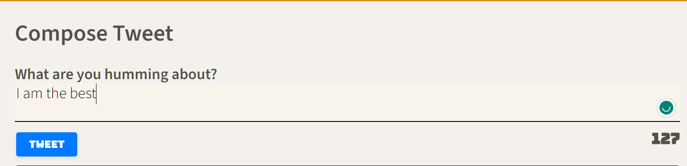
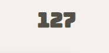
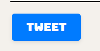
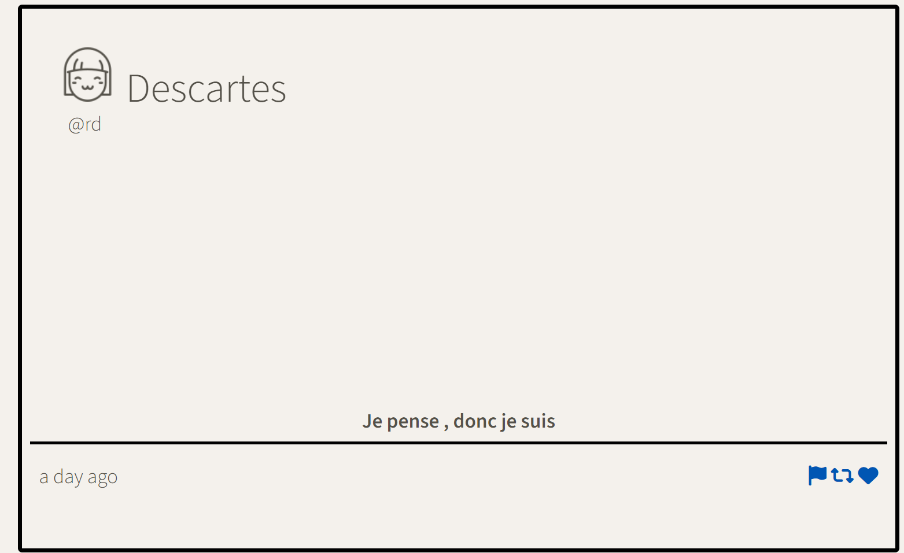
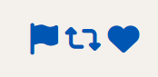
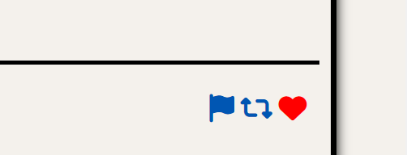
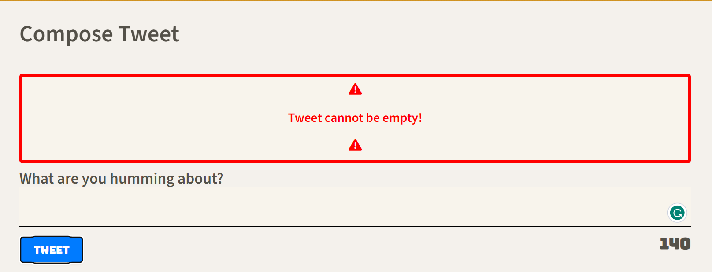
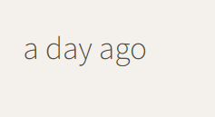

# Tweeter App

A simple, front-end Twitter-like application that allows users to submit their tweets!

## Table of Contents
- [Description](#description)
- [Features](#features)
- [Installation](#installation)
- [Usage](#usage)
- [Contributing](#contributing)
- [License](#license)
- [Screenshots](#screenshots)

## Description
Tweeter is a single-page Twitter clone that utilizes HTML, CSS, JS, jQuery, and AJAX to let users post tweets dynamically.

## Features

1. **Real-time Tweeting:** Submit tweets and see them appear instantly without page refresh.
2. **Dynamic Character Counter:** Keep track of your tweet length with a live counter.
3. **Error Handling:** Receive instant feedback for tweets that are too long or left empty.
4. **Interactive UI:** Hover effects on tweet actions and dynamic tweet composition area.
5. **Relative Time Stamps:** Using the jQuery timeago plugin, tweets display a relative timestamp like "2 hours ago".
6. **Tweet Actions:** Engage with tweets using report, retweet, and like buttons.


## Installation
1. Clone the repository.
2. Ensure you have the necessary dependencies installed. You can get them via:
```nmp install```
3. Run the server to begin using the application.


## Usage

1. Start the application server:
    
    npm start
  

2. Navigate to `http://localhost:8080` in your web browser.

3. Use the navigation bar to compose a new tweet. 

4. Click on the "Write a new tweet" button or the downward arrow icon in the navigation bar to slide down the tweet compose section.

5. Enter your desired tweet (up to 140 characters) in the textbox and click on the "Tweet" button to post.

6. Once tweeted, your tweet will dynamically appear in the tweets section below.

7. For any errors while composing tweets (like exceeding the character limit or entering an empty tweet), a sliding error message will appear above the tweet compose box.

## Contributing

1. Fork the project.
2. Create your feature branch: `git checkout -b feature/YourNewFeature`
3. Commit your changes: `git commit -am 'Add some feature'`
4. Push to the branch: `git push origin feature/YourNewFeature`
5. Submit a pull request.


## License


## Screenshots












## Notes

- The project uses the jQuery timeago plugin to display the relative time of the tweet. For example, "2 hours ago".
- The project has implemented error handling to inform users about issues with their tweets dynamically.
- The tweets are displayed in a reverse chronological order with the newest tweets at the top.

## Credits

This project was developed by Steven Serruya.